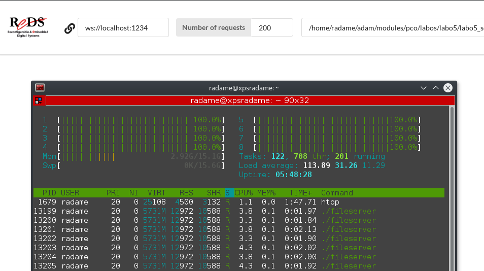
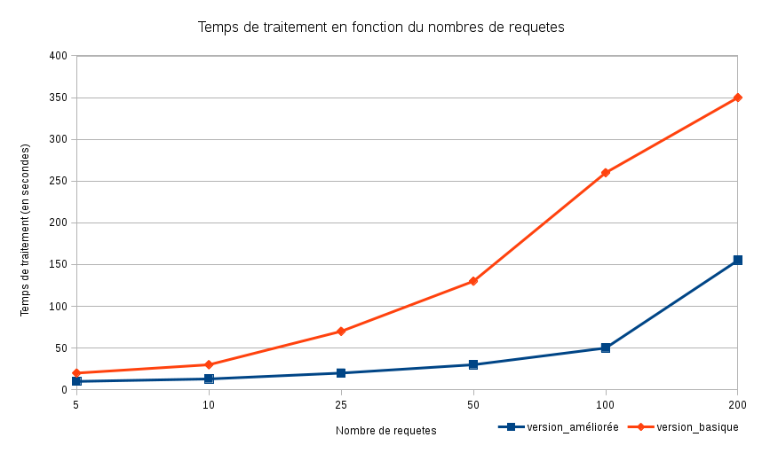
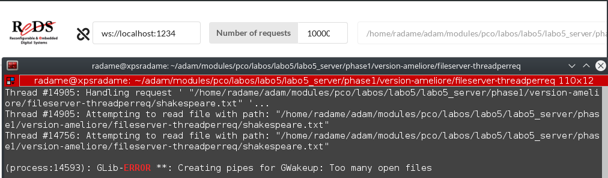

# Laboratoire 5 : Serveur - Phase 1

Auteurs : Oussama Lagha et Adam Zouari
Date : 11 Mai 2018

## Choix du mécanisme

Durant cette phase du laboratoire, nous avons fait le choix d'utiliser les sémaphores afin d'implémenter le mecanisme de producteur-consommateur.

## Implémentation

Nous avons commencer par créer une classe générique `producerconsumerbuffer` qui hérite de la classe générique `AbstractBuffer` fournie. Cette classe nous permet de gérer les tampons de requêtes et de réponses.

Afin d'implémenter le mécanisme de producteur-consommateur, nous avons choisis la version 1 de l'algorithme de tampon simple vu dans le cours. Ce choix a été motivé par soucis de simplicité du code.

Nous avons donc créer ces tampons dans `fileserver.cpp` :
- `requests = new producerconsumerbuffer<Request>();`
- `responses = new producerconsumerbuffer<Response>();`

Ensuite, nous avons créer la classe `requestdispatcherthread` qui permettras à un thread de gérer le traitement des requêtes. Ce thread lancera un thread de traitement pour chaque requête.

Nous avons donc créer ce thread dans `fileserver.cpp` :
- `    reqDispatcher = new requestdispatcherthread(requests,responses,hasDebugLog);`

et nous le lançons `reqDispatcher->start();`

Nous avons crée la classe `requestHandler` qui permettra à un thread de traiter une requête. Le traitement est effectué par la fonction `handle()` fournie. Et la `Reponse` que nous retourne cette fonction, est ajouté au tampon de réponse.

## Comparaison des perfomances

Contrairement à la version basique, nous pouvons voir que le traitement de 200 requetes s'étale ici sur mes 8 processeurs logiques.

Afin de mieux se rendre compte de l'amélioration des performances, nous avons fait le graphique ci-dessous. Pour 100 requêtes, notre version les traitent 5 fois plus rapidement que la version de base (50 secondes contre 260 secondes). En effet, nous constatons une amélioration significative.

## Limitations 

Notre version comporte cependant quelques limitations.
Lorsque je lance 10 000 requetes, ce message d'erreur survient. (Linux Debian)
Je l'expliquerais par le faite que l'OS limite le nombre de tubes (pipes) crée.

On pourrait protéger le serveur de cet effet néfaste, en fixant un nombre de tubes accepté par le server, pour n'utiliser que ceux-ci. Il ne faudrait pas crée des tubes sans arrêt mais plutot en reutilisant ceux qui ne sont plus utilisés.