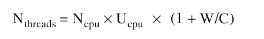
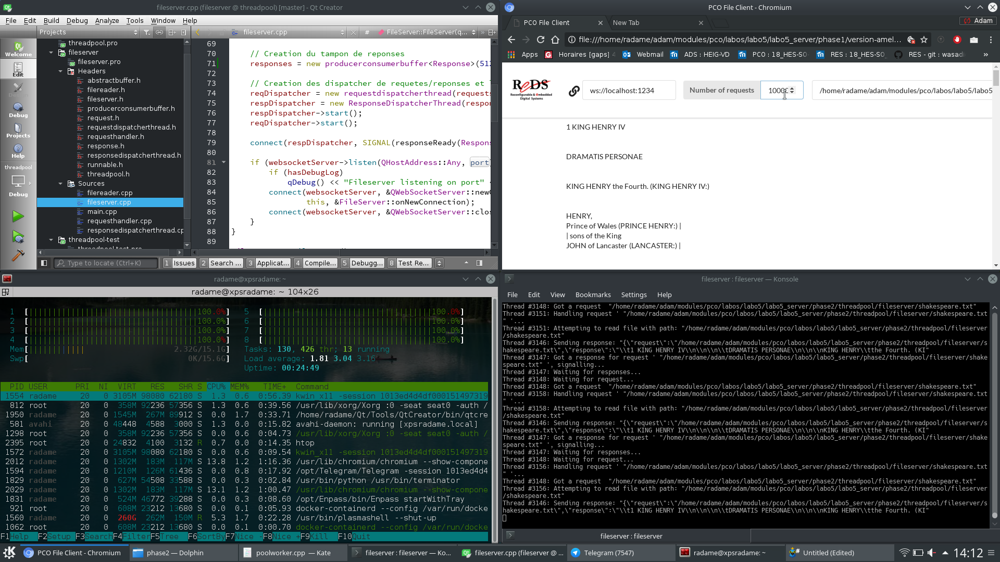

# Laboratoire 5 : Serveur - Phase 2

Auteurs : Oussama Lagha et Adam Zouari
Date : 8 Juin 2018

##But du laboratoire
Ajout d'un threadpool avec un taille maximale afin d'éviter les phénomènes néfastes liés au lancement d'un thread par requête,l'idée est d'allouer dynamiquement des threads au fur et à mesure que cela devient nécessaire jusqu'a atteindre la taille maximale ,si on atteint la taille maximale on doit réutilisé les threads qui ont dejà fini leur travail.

## Choix du mécanisme

Durant cette phase du laboratoire, nous avons fait le choix d'utiliser Mesa afin d'implémenter le mecanisme de threadpool et on a amélioré le mécanisme implémenté durant la phase 1 pour le producerconsumerbuffer pour traiter le cas de la taille maximale .

## Implémentation

Nous avons commencer par amélioré la classe `producerconsumerbuffer` pour traitter le cas ou on veut ajouter dans le tampon et qu'il est plein les threads ne doivent pas attendre.

On a ensuite implémenté le mécanisme de threadpool qui va géré un nombre de thread fixe pour protéger le serveur. Le threadpool gére aussi le recyclage des threads une fois qu'ils sont en etat de waiting. On a pu géré correctement la destruction des thread en utilisant la méthode `requestInterruption()`.

On a ajouter aussi au niveau de la classe `producerconsumerbuffer` la fonction `tryPut(T item)`, cette fonction teste si le tampon est plein ou non, si il ya encore de la place elle va ajouter dans le tampon sans soucis et fini par retourner true sinon elle retourne false et rejete la request.

Enfin, on a adapter le fonctionnement du code de traitement des requêtes entrantes au niveau du thread principal dans le fichier fileserver.cpp en utilisant `tryPut()` au lieu de `put()`.

# Reponses aux questions

La taille de pool optimale est (selon mes recherches 
[source](https://books.google.ch/books?id=VMDAYU5slHUC&pg=PA175&lpg=PA175&dq=taille+de+thread+pool&source=bl&ots=2yUN4TQj04&sig=pLppWFmwgB3KPcGBYUcNFXAUAYI&hl=fr&sa=X&ved=0ahUKEwiR9fO78MPbAhVCvBQKHXfvD-cQ6AEIfDAJ#v=onepage&q=taille%20de%20thread%20pool&f=false)) influencé par le nombre de processeurs N, U l'utilisation souhaité des processeurs (entre 0 et 1) et du rapport entre le temps d'attente et le temps de calcul. 

Dans notre application nous avons décidé d'ignoré le rapport entre le temps d'attente et le temps de calcul et d'utilisé nos processeurs à 100%. Cela reviens au nombre de processeurs.

Desormais, quand on inonde le serveur, le temps de réponse est plus grand mais le serveur ne crash pas, la stabilité est donc meilleure.
Les threads occupent tout les processeurs mais n'utilisent pas plus de memoire que la version 1.

Nous avons réitéré le test de l'etape 1 avec 10000 requetes, et le serveur est toujours up.

